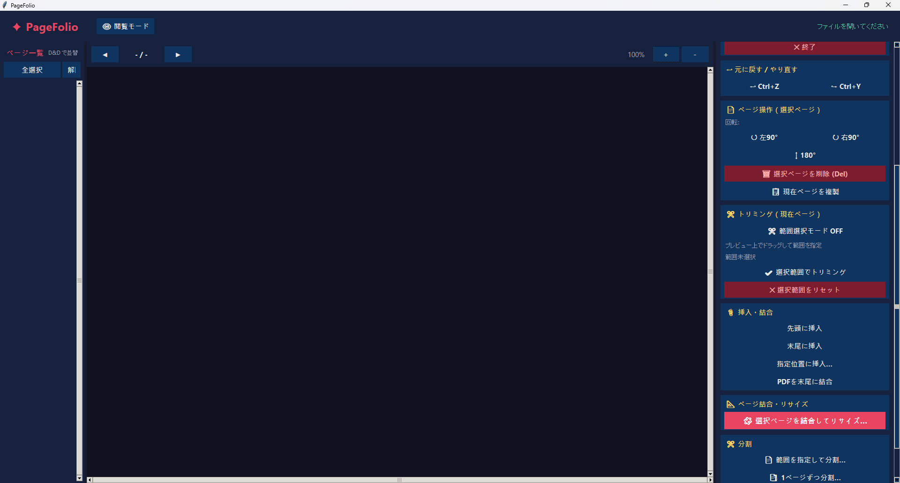
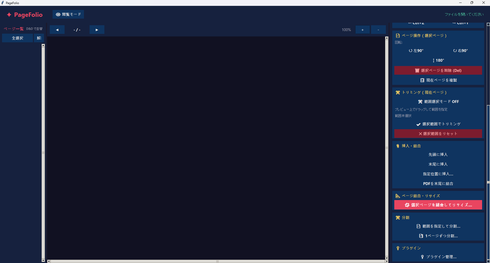
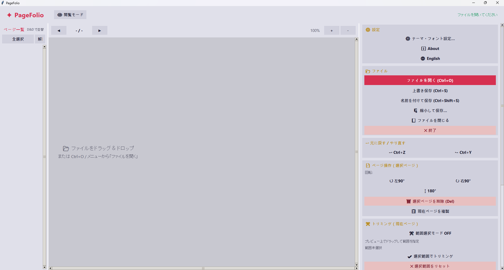
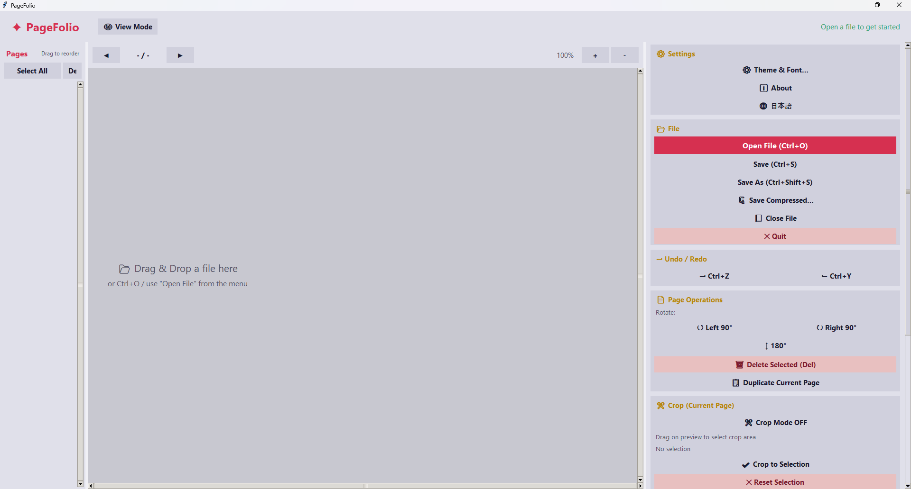
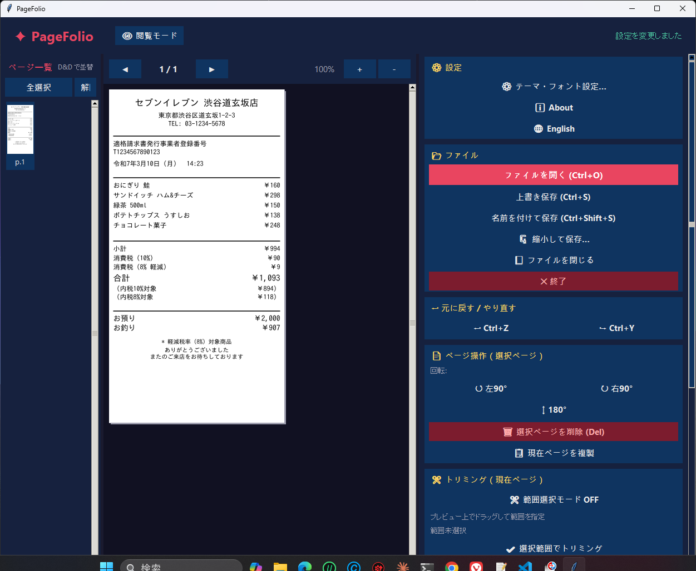
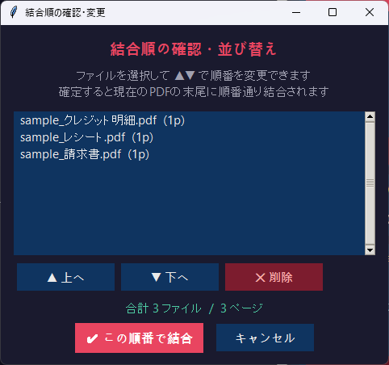

# PageFolio

**PDF ページ整理ツール — Python + Tkinter 製 GUI アプリ**


A PDF page organizer built with Python + Tkinter.  
Windows 11 で動作します / Runs on Windows 11.

> 📝 このプロジェクトは [Claude Code](https://claude.ai/code)（Anthropic）を活用して開発されています。
> AI との協調開発のユースケースとして公開しています。
>
> This project is developed with [Claude Code](https://claude.ai/code) by Anthropic,
> and published as a use case of AI-assisted development.

---

## 概要 / Overview

PageFolio は PDF のページを整理・編集するための GUI ツールです。
テキスト編集や注釈追加は行いません。**ページ単位の操作に特化しています。**

PageFolio is a GUI tool for organizing and editing PDF pages.
It does **not** edit text or add annotations — it focuses on **page-level operations**.

---

## 機能 / Features

| 機能 | 説明 |
|------|------|
| 📂 ファイルを開く | 単一・複数 PDF を読み込み（複数選択時は結合） |
| 💾 保存 | 上書き保存 / 名前を付けて保存 |
| 🔄 ページ回転 | 90° / 180° / 270°、複数ページ一括対応 |
| 🗑 ページ削除 | 選択ページをまとめて削除 |
| ✂ トリミング | プレビュー上のドラッグで余白をカット |
| 📎 挿入・結合 | 別 PDF からページを挿入 / 末尾に結合 |
| ✂ 分割 | ページ範囲指定で分割 / 1ページずつ個別PDFに分割 |
| 🔀 D&D 並び替え | サムネイルをドラッグ＆ドロップでページ順を変更 |
| ↩ Undo / Redo | 最大20回の取り消し・やり直し（Ctrl+Z / Ctrl+Y） |
| 🔍 プレビュー | ズーム・スクロール対応、ページ拡大表示 |
| ⚙ テーマ・フォント | ダーク / ライト / システム連動、フォントサイズ変更 |

---

## ダウンロード / Download

[Releases](https://github.com/mistyura/PageFolio/releases) から最新の `PageFolio.exe` をダウンロードしてください。  
Python のインストールは不要です。ダブルクリックで起動できます。

Download the latest `PageFolio.exe` from [Releases](https://github.com/mistyura/PageFolio/releases).  
No Python installation required — just double-click to run.

---

## 画面構成 / Layout
## スクリーンショット / Screenshot








---

## 注意事項 / Notes

- トリミングは **現在表示中のページ** にのみ適用されます
- 回転・削除は **選択中のページ** が対象です（未選択の場合は現在ページ）
- 保存前にアプリを閉じると編集内容は失われます
- 暗号化・パスワード保護された PDF は開けない場合があります

---

## 🐛 バグ報告・フィードバック / Bug Reports

不具合・要望は [Issues](https://github.com/mistyura/PageFolio/issues) からお知らせください。  
Please report bugs or feature requests via [Issues](https://github.com/mistyura/PageFolio/issues).

---

## 開発者向け情報

## Python から実行する場合 / Run from Python

```bash
pip install pymupdf pillow
python pagefolio.py
```

Python 3.8 以上が必要です / Requires Python 3.8+

---

## EXE ビルド / Build EXE

```bash
pip install pyinstaller
pyinstaller --onefile --noconsole --icon=pagefolio.ico --name=PageFolio pagefolio.py
```

`dist/PageFolio.exe` が生成されます。  
The output `dist/PageFolio.exe` is a standalone single-file executable.

---

## 開発ツール / Development Tools

| ツール | 用途 |
|--------|------|
| [Ruff](https://docs.astral.sh/ruff/) | リント・フォーマット |
| [pytest](https://docs.pytest.org/) | テスト |
| [PyInstaller](https://pyinstaller.org/) | EXE ビルド |

```bash
ruff check . && ruff format .   # リント・フォーマット
pytest                           # テスト実行
```

---

## Claude Code による開発について / About AI-assisted Development

本プロジェクトは Claude Code を使った開発のユースケースとして公開しています。

- `CLAUDE.md` — Claude に渡す構造化された開発指示書
- `開発履歴.md` — 各バージョンの変更内容を記録した開発ログ

　機能追加・バグ修正・UI改善のほぼすべてを Claude Code との対話で実装してきました。

This project is published as a use case of development with Claude Code.

- `CLAUDE.md` — Structured development instructions passed to Claude
- `開発履歴.md` (Development History) — Change log for each version

---

## ライセンス / License

MIT License — see [LICENSE](LICENSE)
