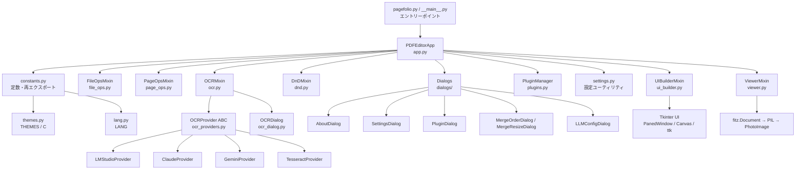

<!-- generated-by: gsd-doc-writer -->
# アーキテクチャ

## システム概要

PageFolio は Windows 11 向けの PDF ページ整理ツールです。ユーザーは PDF ファイルを開き、ページの閲覧・回転・削除・トリミング・挿入・結合・分割・並び替えを GUI 上で行い、編集結果を保存できます。アーキテクチャは **Mixin ベースの階層型レイヤー**構成を採用しており、`PDFEditorApp` が複数の Mixin クラスを多重継承することで機能を組み合わせています。PDF の読み書きとレンダリングには PyMuPDF (fitz)、UI には Tkinter、画像変換には Pillow を使用します。OCR 機能は LM Studio（ローカル）・Claude・Gemini（クラウド）・Tesseract（ローカル）の 4 種類のプロバイダを抽象インターフェース経由で利用できます。

## コンポーネント図



## データフロー

### ファイルオープン

1. `FileOpsMixin._open_file()` がファイルダイアログを表示し、パスを取得する
2. `_open_pdf_path(path)` が `fitz.open(path)` で `fitz.Document` を生成し `self.doc` に代入する
3. `self.current_page = 0`・`self.selected_pages = set()` を初期化する
4. `_refresh_all()` を呼び出し、プレビューとサムネイルを描画する
5. `PluginManager.fire_event("on_file_open", app, path)` でプラグインへ通知する

### ページプレビュー描画

1. `ViewerMixin._show_preview()` がメインスレッドで `_render_preview_pixmap(page_idx, zoom)` を呼ぶ
2. `fitz.Matrix(zoom * 1.5, zoom * 1.5)` でページをレンダリングし、`page.get_pixmap(matrix=mat, alpha=False)` で生 RGB samples を取得する（PNG エンコードは行わない）
3. `PIL.Image.frombytes()` → `ImageTk.PhotoImage()` で Tkinter 表示用画像に変換する
4. `preview_canvas.create_image()` でキャンバスに描画する
5. `_preview_gen` はキャンセル用のインクリメントのみで、比較による世代ガードは行わない（`_show_preview` はメインスレッド同期実行のため不要）

### ページ操作（例: 回転）

1. ユーザーがツールパネルのボタンを押す
2. `PageOpsMixin._rotate_selected(deg)` が `_save_undo("rotate", ...)` でアンドゥ状態を保存する
3. `fitz.Page.set_rotation()` でページの回転角を変更する
4. `_invalidate_thumb_cache(targets)` でキャッシュを無効化する
5. `_refresh_all()` でプレビューとサムネイルを再描画する
6. `_set_status(...)` でヘッダーのステータス表示を更新する
7. `plugin_manager.fire_event("on_page_rotate", ...)` でプラグインへ通知する

### OCR フロー

1. ユーザーが OCR ボタンを押す → `OCRMixin._ocr_current_page()` または `_ocr_selected_pages()` が呼ばれる
2. `build_provider(settings)` がプロバイダ設定（`ocr_provider`）に基づき `OCRProvider` サブクラスを生成する
3. メインスレッドで対象ページを `fitz.Matrix(scale)` でレンダリングし、base64 PNG に変換する
4. `OCRDialog._start_worker_thread()` が `self.concurrency` 個の生 `threading.Thread` デーモンワーカーをキュー消費方式で起動し、`OCRProvider.ocr_image(b64_png, prompt)` を並列実行する（`ThreadPoolExecutor` は使用しない）
5. OCR 結果を `OCRDialog` の結果ビューアに表示し、テキストファイルへのエクスポートを可能にする
6. HTTP 429 / 5xx は `OCRRetryableError` として捕捉し、`clamp_retry_after`（60 秒上限）・`interruptible_sleep`（0.5 秒刻みでキャンセル確認）を使ってリトライする

## 主要な抽象

| 抽象 | ファイル | 説明 |
|------|----------|------|
| `PDFEditorApp` | `pagefolio/app.py` | 6 つの Mixin を多重継承するルートクラス。全状態を保持し、キーバインドを設定する |
| `UIBuilderMixin` | `pagefolio/ui_builder.py` | ttk スタイル定義・PanedWindow レイアウト・ツールバー・サムネイルパネル・プレビューキャンバス・右ツールパネルを構築する |
| `FileOpsMixin` | `pagefolio/file_ops.py` | ファイルの開閉・保存・Undo/Redo（操作種別ごとの差分ベースアンドゥスタック）を実装する |
| `PageOpsMixin` | `pagefolio/page_ops.py` | 回転・削除・複製・トリミング・挿入・結合・分割・リサイズ結合を実装する |
| `ViewerMixin` | `pagefolio/viewer.py` | プレビュー・ズーム・サムネイル（キャッシュ付き）・選択・ポップアップ表示を実装する |
| `DnDMixin` | `pagefolio/dnd.py` | サムネイルのドラッグ＆ドロップによる単一・複数ページ並び替えを実装する |
| `OCRMixin` | `pagefolio/ocr.py` | プロバイダ生成（`build_provider`）・並列 OCR 実行・ボタン状態管理を実装する |
| `OCRProvider` | `pagefolio/ocr_providers.py` | `ocr_image(b64_png, prompt)` と `list_models()` を持つ抽象基底クラス |
| `PDFEditorPlugin` | `pagefolio/plugins.py` | プラグイン基底クラス。ライフサイクルフック（`on_load` / `on_file_open` 等）と `build_ui` を提供する |
| `PluginManager` | `pagefolio/plugins.py` | `plugins/` ディレクトリのプラグイン検出・読み込み・有効/無効管理・イベント発火を担う |
| `OCRDialog` | `pagefolio/ocr_dialog.py` | 複数ページ OCR の進捗表示・結果ビューア・エクスポート UI（`_run_gen` 世代ガードで競合防止） |

## ディレクトリ構成の説明

```
PageFolio/
├── pagefolio.py          # python pagefolio.py 起動用エントリーポイント
├── pagefolio/            # メインパッケージ
│   ├── app.py            # PDFEditorApp 本体（Mixin 統合・状態管理・キーバインド）
│   ├── ui_builder.py     # UIBuilderMixin（スタイル定義・レイアウト構築）
│   ├── file_ops.py       # FileOpsMixin（ファイル操作・Undo/Redo）
│   ├── page_ops.py       # PageOpsMixin（ページ操作全般）
│   ├── viewer.py         # ViewerMixin（プレビュー・サムネイル・ズーム）
│   ├── dnd.py            # DnDMixin（サムネイル D&D 並び替え）
│   ├── ocr.py            # OCRMixin + ヘルパー関数群
│   ├── ocr_providers.py  # OCR プロバイダ実装（LMStudio / Claude / Gemini / Tesseract）
│   ├── ocr_dialog.py     # OCRDialog（複数ページ OCR 結果 UI）
│   ├── dialogs/          # ダイアログパッケージ（About / Settings / Plugin / Merge / LLMConfig）
│   ├── constants.py      # APP_VERSION・ファイル名定数・themes/lang 再エクスポート
│   ├── themes.py         # THEMES 辞書と実行時テーマ辞書 C
│   ├── lang.py           # 言語辞書 LANG（ja / en）
│   ├── settings.py       # 設定ファイル読み書き・テーマ適用・フォントヘルパー
│   ├── plugins.py        # PDFEditorPlugin 基底クラス・PluginManager
│   └── file_drop.py      # tkinterdnd2 によるファイル D&D 受け付け
├── plugins/              # サードパーティ・サンプルプラグイン格納場所
├── tests/                # pytest テストスイート
└── docs/                 # スクリーンショット・ドキュメント
```

**設計意図:**
- `pagefolio/` パッケージを Mixin 単位で分割することで、機能ごとの責務を明確にし、各 Mixin を独立してテストできるようにしている
- `dialogs/` をサブパッケージとして分離することで、ダイアログクラスのファイルサイズを抑制しつつ `from pagefolio.dialogs import SettingsDialog` の後方互換 import を維持している
- `plugins/` ディレクトリをパッケージ外に置くことで、ビルド済み `.exe` と同じフォルダにプラグインを追加するだけで動作する拡張性を確保している

## アーキテクチャ上の制約

### スレッドモデル

- Tkinter UI はメインスレッドで動作する
- プレビューはメインスレッドで同期実行（`_show_preview`）、サムネイルは `root.after(0, ...)` チェーンによりメインスレッドで逐次描画される（`threading.Thread` は使用しない）
- `_thumb_gen` 世代カウンターにより、古い `after()` チェーンの結果が新しい結果を上書きしないよう制御する。`_preview_gen` はインクリメントのみで比較による世代ガードは行わない
- GUI の OCR フロー（`OCRMixin._start_ocr` → `OCRDialog`）は生 `threading.Thread` ワーカーで並列実行する（`ThreadPoolExecutor` は `ocr.py` のヘルパー `run_with_bounded_buffer` / `run_parallel` 内にのみ存在）。`fitz.Document` はスレッド間で共有しない。メインスレッドでレンダリングした base64 PNG のみワーカースレッドへ渡す

### グローバル状態

- `C`（テーマ辞書）と `_current_font_size` は `pagefolio/settings.py` のモジュールレベルの可変シングルトンとして管理され、テーマ変更時に `_apply_theme()` で一括更新される

### Undo/Redo の設計

- アンドゥスタックは `deque(maxlen=20)`（`MAX_UNDO = 20`）で上限管理される
- `file_ops.py` の `_save_undo()` は操作種別（`op`）ごとに必要最小限の差分データ（回転角・CropBox 座標・削除ページのバイト列など）のみを保存する差分ベース方式を採用している
- ページ内容をバイト列として保存するのは削除操作（各ページの `tmp.tobytes()`）と `merge_resize` 操作（`merged_bytes` および `orig_pages` のバイト列）である

### API キーのセキュリティ

- API キー（Claude / Gemini）は `pagefolio_settings.json` に保存されない
- `settings.py` の `_SENSITIVE_KEYS` ガードが保存時に機密キーを除外する最後の砦として機能する
- API キーはセッションメモリ（`app._session_api_keys`）または環境変数のみに保持され、プロセス終了と同時に消滅する

### CropBox の安全処理

- すべてのトリミング操作で CropBox は必ず MediaBox の範囲内にクランプしてから `page.set_cropbox()` を呼ぶ
- `set_cropbox` はメタデータ上の cropbox を変更するのみで、PDF の物理的なページサイズは変わらない
