<!-- generated-by: gsd-doc-writer -->
# アーキテクチャ

## システム概要

PageFolio は Windows 11 向けの PDF ページ整理ツールです。ユーザーは PDF ファイルを開き、ページの閲覧・回転・削除・トリミング・黒塗り（redaction）/モザイク・挿入・結合・分割・並び替え・OCR（単一/バッチ）を GUI 上で行い、編集結果を保存できます。アーキテクチャは **Mixin ベースの階層型レイヤー**構成を採用しており、`PDFEditorApp` が 8 つの Mixin クラスを多重継承することで機能を組み合わせています。PDF の読み書きとレンダリングには PyMuPDF (fitz)、UI には Tkinter、画像変換には Pillow を使用します。OCR 機能は LM Studio・Ollama（ローカル）・Claude・Gemini・RunPod（クラウド）・Tesseract（ローカル）の 6 種類の組み込みプロバイダを抽象インターフェース経由で利用でき、プラグインによる追加プロバイダ登録にも対応します。Undo/Redo は操作種別ごとの差分（デルタ）ベースで、大きいページ bytes は `UndoBlobStore` によりディスクへ退避されメモリを保護します。OCR の実行制御（リトライ・キャンセル・並列化・進捗集計）は Tkinter/PyMuPDF に依存しない純ロジック層（`ocr_pipeline.py` / `ocr_engine.py` / `batch_ocr_state.py`）に切り出されており、単体テストで検証されています。

## コンポーネント図

```mermaid
graph TD
    A[pagefolio.py / __main__.py\nエントリーポイント] --> B[PDFEditorApp\napp.py]

    B --> C[UIBuilderMixin\nui_builder.py]
    B --> D[FileOpsMixin\nfile_ops.py]
    B --> E[PageOpsMixin\npage_ops.py]
    B --> RX[RedactOpsMixin\nredact_ops.py]
    B --> F[ViewerMixin\nviewer.py]
    B --> G[DnDMixin\ndnd.py]
    B --> H[OCRMixin\nocr.py]
    B --> PR[PrintOpsMixin\nprint_ops.py]

    D --> US[UndoBlobStore\nundo_store.py\nMemBlob / FileBlob]
    F --> PG[pagination.py\n窓計算・local⇄global 変換]
    F --> TC[thumb_cache.py\nLruCache]

    B --> I[PluginManager\nplugins.py]
    B --> J[settings.py\n設定ユーティリティ]
    B --> K[constants.py\n定数・再エクスポート]
    B --> TS[toast.py\nToastManager]
    K --> L[themes.py\nTHEMES / C]
    K --> M[lang.py\nLANG]

    H --> N[build_provider\nocr.py]
    N --> OP[ocr_providers/\nOCRProvider ABC]
    OP --> O[LMStudioProvider]
    OP --> P[ClaudeProvider]
    OP --> Q[GeminiProvider]
    OP --> R[TesseractProvider]
    OP --> O2[OllamaProvider]
    OP --> O3[RunPodProvider]
    OP --> REG[registry.py\nプロバイダ→環境変数]
    I -.register_ocr_provider.-> OP

    H --> S[OCRDialog\nocr_dialog.py]
    S --> ENG[OCRRunEngine\nocr_engine.py]
    ENG --> PL[ocr_pipeline.py\nPipelineState / consume_one]
    S --> FB[ocr_fallback.py\n次候補プロバイダ選択]
    S --> MD[md_render.py\nparse_markdown]

    B --> BM[メニューバー\n_build_menubar]
    BM --> BOD[BatchOCRDialog\ndialogs/batch_ocr.py]
    BOD --> BST[batch_ocr_state.py\nBatchFileEntry / BatchState]
    BOD --> ENG

    B --> T[Dialogs\ndialogs/]
    T --> T1[AboutDialog]
    T --> T2[SettingsDialog]
    T --> T3[PluginDialog]
    T --> T4[MergeOrderDialog / MergeResizeDialog]
    T --> T5[LLMConfigDialog\ndialogs/llm_config/]
    T --> T6[ExportImagesDialog]
    T --> T7[SetPasswordDialog]
    T --> T8[ShortcutsDialog]

    C --> U[Tkinter UI\nPanedWindow / Canvas / ttk]
    F --> V[fitz.Document → PIL → PhotoImage]
```



## データフロー

### ファイルオープン

1. `FileOpsMixin._open_file()` がファイルダイアログを表示し、パスを取得する
2. `_open_pdf_path(path)` が `fitz.open(path)` で `fitz.Document` を生成し `self.doc` に代入する（パスワード保護 PDF は `_authenticate_doc` で入力を求める）
3. `self.current_page = 0`・`self.selected_pages = set()` を初期化する
4. `_refresh_all()` を呼び出し、プレビューとサムネイルを描画する
5. `PluginManager.fire_event("on_file_open", app, path)` でプラグインへ通知する

### ページプレビュー描画

1. `ViewerMixin._show_preview()` がメインスレッドで `_render_preview_pixmap(page_idx, zoom)` を呼ぶ
2. `fitz.Matrix(zoom * 1.5, zoom * 1.5)` でページをレンダリングし、`page.get_pixmap(matrix=mat, alpha=False)` で生 RGB samples を取得する（PNG エンコードは行わない）
3. `PIL.Image.frombytes()` → `ImageTk.PhotoImage()` で Tkinter 表示用画像に変換する
4. `preview_canvas.create_image()` でキャンバスに描画する
5. `_preview_gen` はキャンセル用のインクリメントのみで、比較による世代ガードは行わない（`_show_preview` はメインスレッド同期実行のため不要）

### サムネイル表示（ページネーション窓）

1. `pagination.py` の `window_bounds(window_start, page_size, n_pages)` が表示窓の半開区間 `(lo, hi)` を計算する（`PAGE_SIZE_MIN=10` / `PAGE_SIZE_MAX=100` / 既定 20）
2. `selected_pages` は常に全ページインデックス（global）で保持し、描画・D&D・選択照合の際に `to_local(global_idx, window_start)` / `to_global(local_pos, window_start)` で変換する
3. `ViewerMixin` が `root.after(0, ...)` チェーンでサムネイルを逐次描画し、`_thumb_gen` 世代カウンターで古いチェーンの結果を破棄する（`threading.Thread` は使用しない）
4. サムネイル画像は `thumb_cache.py` の `LruCache`（容量 `THUMB_CACHE_MAX=300`）にページ番号キーでキャッシュされ、容量超過時は最古参照分から自然にエビクトされる

### ページ操作（例: 回転）

1. ユーザーがツールパネルのボタンを押す
2. `PageOpsMixin._rotate_selected(deg)` が `_save_undo("rotate", ...)` でアンドゥ状態を保存する
3. `fitz.Page.set_rotation()` でページの回転角を変更する
4. `_invalidate_thumb_cache(targets)` でキャッシュを無効化する
5. `_refresh_all()` でプレビューとサムネイルを再描画する
6. `_set_status(...)` でヘッダーのステータス表示を更新する
7. `plugin_manager.fire_event("on_page_rotate", ...)` でプラグインへ通知する

### ページ編集（黒塗り・モザイク）

1. `RedactOpsMixin._toggle_redact_mode()` で黒塗りモードを ON にする（トリミングモードとは相互排他、矩形選択はトリミングと同じキャンバスドラッグ処理を共用）
2. 適用前に `_capture_page_blob(page_i)` でページ全体を `page_edit` op としてキャプチャする（undo 用）
3. `add_redact_annot` + `apply_redactions()` で矩形下のテキスト・画像を実削除する（PyMuPDF 仕様上、矩形に交差する注釈も削除される）
4. モザイクの場合はさらにピクセル化画像を焼き込む（下地コンテンツは先に redaction 済みのため抽出漏えいを防止）
5. `_refresh_all()` で再描画し、`_redact_mode_off()` でモードを OFF に戻す

### 印刷

1. `PrintOpsMixin._print_pdf()`（`Ctrl+P`）が `write_print_tempfile(doc)` で現在の `fitz.Document` を一時 PDF へ書き出す（編集内容を反映するため）
2. `_send_to_printer(path)` が Windows では `os.startfile(path, "print")` で既定 PDF ハンドラの印刷動詞を起動する
3. 印刷動詞が未関連付けの場合は `os.startfile(path)`（open 動詞）にフォールバックする
4. Windows 以外（`os.startfile` が存在しない環境）は未対応の情報通知に留める。失敗時は `toast.py` の `ToastManager` が再試行アクション付きの通知を表示する

### OCR フロー（単一ファイル）

1. ユーザーが OCR ボタンを押す → `OCRMixin._ocr_current_page()` または `_ocr_selected_pages()` が呼ばれる
2. `build_provider(settings, api_key, plugin_manager)` がプロバイダ設定（`ocr_provider`）に基づき `OCRProvider` サブクラスを生成する。組み込み 6 種（claude/gemini/lmstudio/tesseract/ollama/runpod）に加え、`plugin_manager.get_ocr_provider(name)` 経由でプラグイン登録プロバイダも解決できる
3. メインスレッドで対象ページを `fitz.Matrix(scale)` でレンダリングし、base64 PNG に変換する（`fitz.Document` はスレッド間で共有しない）
4. `OCRDialog` が `OCRRunEngine`（`ocr_engine.py`）を生成して `start()` を呼び、`concurrency` 本の consumer デーモンスレッドを起動する。各ワーカーは `ocr_pipeline.py` の `consume_one()` に委譲し、キュー投入は `try_enqueue()`、完了シグナルは `send_sentinels()` が担う（producer-consumer 構成・`queue.Queue` は `start()` 内で一度だけ生成）
5. OCR 結果は `OCRDialog` の結果ビューアに表示され、`preset=="markdown"` のときは `md_render.parse_markdown()` で整形描画（`_insert_markdown`）される。コピー/保存は raw テキストを維持する
6. 「📊 サマリ作成」でページ横断の統合サマリを生成できる（`_on_summary` / `_summary_worker`、専用キャンセルフラグ）
7. HTTP 429 / 5xx は `OCRRetryableError` として捕捉し、`clamp_retry_after`（60 秒上限）・`interruptible_sleep`（0.5 秒刻みでキャンセル確認）を使ってリトライする
8. プロバイダ障害時は `ocr_fallback.py` の `next_fallback_candidate()` / `next_summary_candidate()` が設定済みフォールバック連鎖から次候補を選び、`OCRDialog` がプロバイダを切り替えて再試行できる

### バッチ OCR フロー（複数ファイル）

1. メニューバー「ツール」→「バッチOCR」で `BatchOCRDialog`（`dialogs/batch_ocr.py`）を開く。メインウィンドウで開いている `doc`/`filepath` とは完全に独立し、ユーザーが選択した複数 PDF/画像ファイルを個別に処理する
2. `batch_ocr_state.py` の `enqueue_files()` がファイルパスを重複除外しつつ `BatchFileEntry`（`STATUS_PENDING` 等の状態を持つ per-file エントリ）としてキューへ追加する
3. `BatchState`（ファイル軸の完了/失敗/キャンセル集計、`total_files = count_pending(entries)` で壊れた PDF を分母から除外）がファイル単位の進捗を管理する
4. ファイルごとに新しい `OCRRunEngine` インスタンスを生成して逐次実行し、ページ単位の進捗は `OCRRunEngine.progress_count()` が真の情報源となる（ファイル軸とページ軸の集計は独立して二重管理されない）

## 主要な抽象

| 抽象 | ファイル | 説明 |
|------|----------|------|
| `PDFEditorApp` | `pagefolio/app.py` | 8 つの Mixin を多重継承するルートクラス。全状態を保持し、キーバインド・メニューバーを構築する |
| `UIBuilderMixin` | `pagefolio/ui_builder.py` | ttk スタイル定義・PanedWindow レイアウト・ツールバー・サムネイルパネル・プレビューキャンバス・右ツールパネルを構築する |
| `FileOpsMixin` | `pagefolio/file_ops.py` | ファイルの開閉・保存・Undo/Redo（差分ベースアンドゥスタック）・パスワード付与/解除を実装する |
| `PageOpsMixin` | `pagefolio/page_ops.py` | 回転・削除・トリミング・挿入・結合・分割を実装する |
| `RedactOpsMixin` | `pagefolio/redact_ops.py` | 黒塗り（redaction）・モザイクを実装する。矩形選択はトリミングと共用 |
| `ViewerMixin` | `pagefolio/viewer.py` | プレビュー・ズーム・サムネイル（`LruCache` キャッシュ付き）・選択・ポップアップ表示を実装する |
| `DnDMixin` | `pagefolio/dnd.py` | サムネイルのドラッグ＆ドロップによる単一・複数ページ並び替えを実装する |
| `OCRMixin` | `pagefolio/ocr.py` | プロバイダ生成（`build_provider`）・並列 OCR 実行（`run_parallel`）・プロンプト解決・ボタン状態管理を実装する |
| `PrintOpsMixin` | `pagefolio/print_ops.py` | 印刷（既定 PDF ハンドラ送信・`write_print_tempfile`）を実装する |
| `OCRProvider` | `pagefolio/ocr_providers/base.py` | `ocr_image(b64_png, prompt)` / `ocr_image_ex` / `list_models()` を持つ抽象基底クラス。`complete_text_ex` / `supports_text_prompt` で全ページ統合サマリを生成する。サブクラスは `claude.py` / `gemini.py` / `lmstudio.py` / `ollama.py` / `runpod.py` / `tesseract.py` に分割配置される |
| `GeminiProvider._is_legacy_gemini` | `pagefolio/ocr_providers/gemini.py` | モデル ID 先頭の世代番号（`_model_generation`）が 2 以下と判定できた場合のみ `True` を返す世代ゲート（v1.8.1）。`_build_generation_config()` はこれを見て `temperature` / `thinkingConfig`（thinkingBudget）の送信要否を切り替える |
| `OCRRunEngine` | `pagefolio/ocr_engine.py` | 単一ファイル/バッチ OCR 双方が再利用する consumer 側実行エンジン。キュー・ワーカースレッド・`PipelineState` を所有し、完了理由別コールバック（`on_complete`/`on_cancelled`/`on_fatal`）を提供する |
| `PipelineState` / `consume_one` / `try_enqueue` / `send_sentinels` | `pagefolio/ocr_pipeline.py` | 複数ページ OCR 実行の producer-consumer 純ロジック層（Tk/fitz 非依存）。共有カウンタ・fatal 判定・サーキットブレーカーを担う |
| `BatchFileEntry` / `BatchState` | `pagefolio/batch_ocr_state.py` | バッチ OCR のファイルキュー状態遷移とファイル軸進捗集計を担う純ロジック層 |
| `PDFEditorPlugin` | `pagefolio/plugins.py` | プラグイン基底クラス。ライフサイクルフック（`on_load` / `on_file_open` 等）と `build_ui` を提供する |
| `PluginManager` | `pagefolio/plugins.py` | `plugins/` ディレクトリのプラグイン検出・読み込み・有効/無効管理・イベント発火・OCR プロバイダ登録（`register_ocr_provider`）を担う |
| `OCRDialog` | `pagefolio/ocr_dialog.py` | 複数ページ OCR の進捗表示・結果ビューア・エクスポート UI（`_run_gen` 世代ガードで競合防止・Markdown 整形描画）。内部で `OCRRunEngine` を利用する薄いオーケストレーション層 |
| `BatchOCRDialog` | `pagefolio/dialogs/batch_ocr.py` | 複数ファイルを対象としたバッチ OCR 実行 UI。メインウィンドウの `doc`/`filepath` に依存しない独立設計 |
| `LLMConfigDialog` | `pagefolio/dialogs/llm_config/` | クラウド/ローカル LLM 設定 UI（`dialog.py`）・モデル一覧の非同期取得（`model_fetch.py`）・設定セクション UI（`sections.py`）に分割されたサブパッケージ |
| `MemBlob` / `FileBlob` / `UndoBlobStore` | `pagefolio/undo_store.py` | undo デルタのページ bytes を保持/退避する Blob。64KiB 以上は tempfile へ退避する Tk/fitz 非依存の純ロジック層 |
| `LruCache` | `pagefolio/thumb_cache.py` | サムネイル画像の LRU キャッシュ。キーはページ番号のみ、Tk/fitz 非依存の汎用コンテナ |
| `ToastManager` | `pagefolio/toast.py` | 保存/印刷失敗時の再試行アクション付き非モーダル通知（メインウィンドウ右下オーバーレイ・同時表示 1 件） |
| `pagination` 純関数群 | `pagefolio/pagination.py` | `window_bounds` / `to_global` / `to_local` / `clamp_page_size` 等、サムネイル窓とページインデックス変換の純ロジック |
| `parse_markdown` | `pagefolio/md_render.py` | OCR 結果の Markdown を (行種別, インライン span) へ変換する純関数 |
| `next_fallback_candidate` / `next_summary_candidate` | `pagefolio/ocr_fallback.py` | OCR プロバイダ障害時の次候補選択を担う純ロジック層 |
| `registry.py` プロバイダ→環境変数レジストリ | `pagefolio/ocr_providers/registry.py` | プロバイダ名から API キー環境変数名を解決する中央レジストリ。標準ライブラリ `os` のみに依存し、pagefolio 内部モジュールを import しない独立性制約を持つ |

## ディレクトリ構成の説明

```
PageFolio/
├── pagefolio.py             # python pagefolio.py 起動用エントリーポイント
├── pagefolio/                # メインパッケージ
│   ├── app.py                 # PDFEditorApp 本体（Mixin 統合・状態管理・キーバインド・メニューバー）
│   ├── ui_builder.py         # UIBuilderMixin（スタイル定義・レイアウト構築）
│   ├── file_ops.py           # FileOpsMixin（ファイル操作・Undo/Redo・Blob ライフサイクル）
│   ├── undo_store.py         # undo デルタのディスク退避ストア（MemBlob/FileBlob/UndoBlobStore）
│   ├── page_ops.py           # PageOpsMixin（回転/削除/トリミング/挿入/結合/分割）
│   ├── redact_ops.py         # RedactOpsMixin（黒塗り・モザイク）
│   ├── print_ops.py          # PrintOpsMixin（印刷）
│   ├── viewer.py             # ViewerMixin（プレビュー・サムネイル・ズーム）
│   ├── thumb_cache.py        # サムネイル LRU キャッシュ（LruCache）
│   ├── toast.py               # 非モーダルトースト通知（ToastManager）
│   ├── dnd.py                  # DnDMixin（サムネイル D&D 並び替え）
│   ├── file_drop.py          # tkinterdnd2 によるファイル D&D 受け付け
│   ├── pagination.py         # サムネイル窓計算・local⇄global インデックス変換の純関数群
│   ├── ocr.py                  # OCRMixin + build_provider 等のヘルパー関数群
│   ├── ocr_pipeline.py       # OCR producer-consumer 純ロジック層（PipelineState/consume_one）
│   ├── ocr_engine.py         # OCRRunEngine（単一/バッチ OCR 共用の consumer 実行エンジン）
│   ├── ocr_fallback.py       # プロバイダフォールバック候補選択の純ロジック層
│   ├── batch_ocr_state.py    # バッチ OCR のファイルキュー状態遷移（BatchFileEntry/BatchState）
│   ├── ocr_providers/        # OCR プロバイダ実装パッケージ
│   │   ├── base.py             # OCRProvider 抽象基底クラス
│   │   ├── claude.py           # ClaudeProvider
│   │   ├── gemini.py           # GeminiProvider
│   │   ├── lmstudio.py         # LMStudioProvider
│   │   ├── ollama.py           # OllamaProvider
│   │   ├── runpod.py           # RunPodProvider
│   │   ├── tesseract.py        # TesseractProvider
│   │   ├── errors.py           # OCR 例外・HTTP エラーマッピング
│   │   └── registry.py         # プロバイダ→環境変数レジストリ（独立モジュール）
│   ├── md_render.py          # Markdown→行種別/インライン span 変換の純関数
│   ├── ocr_dialog.py         # OCRDialog（単一ファイル複数ページ OCR 結果 UI）
│   ├── dialogs/                # ダイアログパッケージ
│   │   ├── about.py            # AboutDialog
│   │   ├── settings.py         # SettingsDialog
│   │   ├── plugin.py           # PluginDialog
│   │   ├── merge.py            # MergeOrderDialog / MergeResizeDialog
│   │   ├── password.py         # SetPasswordDialog
│   │   ├── shortcuts.py        # ShortcutsDialog
│   │   ├── export_images.py    # ExportImagesDialog
│   │   ├── batch_ocr.py        # BatchOCRDialog（複数ファイルのバッチ OCR）
│   │   └── llm_config/         # LLMConfigDialog サブパッケージ（dialog.py/model_fetch.py/sections.py）
│   ├── constants.py           # APP_VERSION・ファイル名定数・themes/lang 再エクスポート
│   ├── themes.py              # THEMES 辞書と実行時テーマ辞書 C
│   ├── lang.py                 # 言語辞書 LANG（ja / en）
│   ├── settings.py            # 設定ファイル読み書き・テーマ適用・フォントヘルパー
│   └── plugins.py             # PDFEditorPlugin 基底クラス・PluginManager
├── plugins/                    # サードパーティ・サンプルプラグイン格納場所
├── tests/                      # pytest テストスイート
└── docs/                       # スクリーンショット・ドキュメント
```

**設計意図:**
- `pagefolio/` パッケージを Mixin 単位で分割することで、機能ごとの責務を明確にし、各 Mixin を独立してテストできるようにしている
- `undo_store.py` / `pagination.py` / `md_render.py` / `ocr_pipeline.py` / `ocr_engine.py` / `ocr_fallback.py` / `batch_ocr_state.py` / `thumb_cache.py` を Tk・fitz 非依存の純関数/軽量クラス層として切り出すことで、GUI を起動せずロジックだけを単体テストできるようにしている
- `dialogs/` と `ocr_providers/` をサブパッケージとして分離することで、個々のファイルサイズを抑制しつつ `from pagefolio.dialogs import SettingsDialog` / `from pagefolio.ocr_providers import ClaudeProvider` 等の後方互換 import を再エクスポート（`__init__.py`）で維持している
- `ocr_providers/registry.py` は標準ライブラリ `os` のみに依存する独立モジュールとし、`settings.py` 等からの参照時に循環 import が発生しない構造を確保している
- `BatchOCRDialog` はメインウィンドウの `doc`/`filepath` に依存しない設計とし、単一ファイル OCR（`OCRDialog`）とは独立したファイルキューで複数ファイルを処理できるようにしている
- `plugins/` ディレクトリをパッケージ外に置くことで、ビルド済み `.exe` と同じフォルダにプラグインを追加するだけで動作する拡張性を確保している

## アーキテクチャ上の制約

### スレッドモデル

- Tkinter UI はメインスレッドで動作する
- プレビューはメインスレッドで同期実行（`_show_preview`）、サムネイルは `root.after(0, ...)` チェーンによりメインスレッドで逐次描画される
- `_thumb_gen` 世代カウンターにより、古い `after()` チェーンの結果が新しい結果を上書きしないよう制御する。`_preview_gen` はインクリメントのみで比較による世代ガードは行わない
- OCR の並列実行は `OCRRunEngine`（`ocr_engine.py`）が所有する。`start()` 内で `queue.Queue` / `PipelineState` を一度だけ生成し、`concurrency` 本の生 `threading.Thread` デーモンワーカーを起動する。各ワーカーは `ocr_pipeline.py` の `consume_one()` に処理を委譲し、完了時（キュー空 + 全ワーカー終了）に理由別コールバック（`on_complete`/`on_cancelled`/`on_fatal`）を発火する。単一ファイル OCR（`OCRDialog`）とバッチ OCR（`BatchOCRDialog`）はいずれも `OCRRunEngine` を新規生成して利用する
- `fitz.Document` はスレッド間で共有せず、メインスレッドでレンダリングした base64 PNG のみワーカースレッドへ渡す

### グローバル状態

- `C`（テーマ辞書）と `_current_font_size` は `pagefolio/settings.py` のモジュールレベルの可変シングルトンとして管理され、テーマ変更時に `_apply_theme()` で一括更新される

### Undo/Redo の設計

- アンドゥ/リドゥスタックは `deque(maxlen=20)`（`PDFEditorApp.MAX_UNDO = 20`）で上限管理される
- `file_ops.py` の `_save_undo()` は操作種別（`op`）ごとに必要最小限の差分データ（回転角・CropBox 座標・削除/編集ページのバイト列など）のみを保存する差分ベース方式を採用している
- ページ単位のバイト列キャプチャは必ず `_capture_page_blob(page_i)` 経由で行う。64KiB 以上のデータは `UndoBlobStore` が tempfile へ退避（`FileBlob`）し、未満はメモリ保持（`MemBlob`）する
- 復元側は生 bytes との後方互換のため `self._blob_bytes(data)` で bytes を取り出す
- Blob の解放は、deque 溢れ時の evict（`_push_evicting`）・redo クリア（`_clear_redo_stack`）・undo/redo 消費時（identity 比較付き dispose）・ファイルクローズ/アプリ終了時（`_clear_undo_stacks` → `UndoBlobStore.purge()`）に加え `atexit` でも行われる。スタックへの直接 `append` / `clear` は Blob リークを招くため禁止

### OCR プロバイダの拡張性

- 組み込みプロバイダは `pagefolio/ocr_providers/` パッケージ配下に 1 ファイル 1 プロバイダで実装され、`OCRProvider` 抽象基底クラス（`base.py`）を継承する
- プラグインは `PluginManager.register_ocr_provider(name, cls)` を通じて独自の `OCRProvider` サブクラスを登録できる。登録名が組み込みプロバイダ名（claude/gemini/lmstudio/tesseract/ollama/runpod/off）と衝突する場合は拒否され、プラグイン同士の重複は後勝ちで上書きされる
- `ocr_providers/registry.py` はプロバイダ名から API キー環境変数名（例: claude → `ANTHROPIC_API_KEY`）を解決する中央レジストリであり、標準ライブラリ `os` 以外に依存しない。新規プロバイダの機密キー定義追加はこの 1 ファイルに閉じる設計となっている
- **Gemini 新世代モデルのパラメータ制限対応（v1.8.1）**: gemini-3 世代以降は `temperature` 等のサンプリングパラメータおよび `thinkingConfig`（thinkingBudget）の指定が 400 INVALID_ARGUMENT で拒否される。`GeminiProvider._is_legacy_gemini()` がモデル ID 先頭の世代番号（`_model_generation`、例: `gemini-2.5-flash` → 2）を判定し、2 以下の旧世代にのみこれらのパラメータを送信する。バージョンレスのエイリアス（`gemini-flash-latest` 等）は世代判定不能のため新世代扱い（省略）とし、安全側に倒す。gemma 等の非 gemini 系モデルは従来どおり `temperature` を送信する

### API キーのセキュリティ

- API キー（Claude / Gemini / RunPod）は `pagefolio_settings.json` に保存されない
- `settings.py` の `_SENSITIVE_KEYS`（`ocr_providers/registry.py` の `sensitive_keys()` から自動生成）が保存時に機密キーを除外する最後の砦として機能する
- API キーはセッションメモリ（`app._session_api_keys`）または環境変数のみに保持され、プロセス終了と同時に消滅する

### CropBox の安全処理

- すべてのトリミング操作・黒塗り/モザイク矩形は必ず MediaBox の範囲内にクランプしてから `page.set_cropbox()` を呼ぶ
- `set_cropbox` はメタデータ上の cropbox を変更するのみで、PDF の物理的なページサイズは変わらない
- トリミング・黒塗り/モザイクの矩形は回転表示中のページでも未回転のページ座標系で適用される
